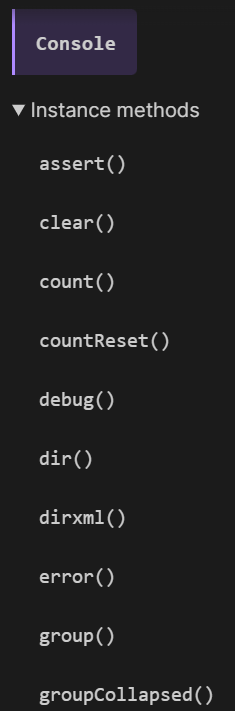
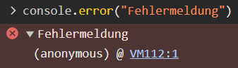

# Woche 3

<span style="background-color: #e0e0e0; border-radius: 10px; padding: 5px 10px;">01.10.2024</span>

### Inhalt

Bearbeitet Dateien

- [lambda.js](./lambda.js)
- [lambdaTest.js](./lambdaTest.js)

Weitere Ressourcen

- [Kolibri](https://webengineering-fhnw.github.io/Kolibri/index.html) (FHNW Web Engineering Toolkit)

##### Javascript Goodies

in console schreiben mit console.log()
gibt aber noch viele andere funktionen für die console



mehrere parameter in console.log werden zusammen ausgegeben aber jeweils pro Browser anders formatiert.

`console.log` levels (info, log, error, warn)
error macht aber noch etwas unterschiedlich. gibt stacktrace aus.

`console.log` object can man inspekten. Dasselbe mit arrays.

##### Lambda Boolean Logic

In der Lambda-Kalkül-Logik werden Booleans durch Funktionen dargestellt. Zwei wichtige Funktionen sind `T` und `F`, die als `True` und `False` verwendet werden. Diese Funktionen sind sogenannte "higher-order functions", da sie andere Funktionen als Argumente akzeptieren.

`T` (True) wird definiert als eine Funktion, die zwei Argumente nimmt und das erste zurückgibt:

```javascript
const T = (t) => (f) => t;
```

`F` (False) wird definiert als eine Funktion, die zwei Argumente nimmt und das zweite zurückgibt:

```javascript
const F = (t) => (f) => f;
```

Mit diesen beiden Funktionen lassen sich logische Operationen wie `and`, `or`, und `not` implementieren.

`and` gibt True zurück, wenn beide Argumente True sind, ansonsten False:

```javascript
const and = (a) => (b) => a(b)(a);
```

`or` gibt True zurück, wenn mindestens ein Argument True ist:

```javascript
const or = (a) => (b) => a(a)(b);
```

##### Lambda Algebraic Datatypes

In der Lambda-Kalkül können wir algebraische Datentypen wie **Paare** oder **Optionen** modellieren. Diese werden ebenfalls als Funktionen implementiert.

`Pair`: Ein Paar kann als eine Funktion angesehen werden, die zwei Werte speichert und basierend auf einer übergebenen Funktion einen dieser Werte zurückgibt:

```javascript
const Pair = (fn) => (ln) => (fnOrLn) => fnOrLn(fn)(ln);
```

Hierbei kann man über Hilfsfunktionen wie `firstname` und `lastname` auf die einzelnen Werte zugreifen:

```javascript
const firstname = konst;
const lastname = snd;
```

`Either`: Der algebraische Datentyp `Either` kann verwendet werden, um zwei mögliche Werte zu repräsentieren, entweder `Left` (für Fehler) oder `Right` (für Erfolg). Dies ist nützlich für Fehlermanagement und ist eine Form des "Entweder-Oder"-Prinzips.

`Left` repräsentiert einen Fehler:

```javascript
const Left = (x) => (f) => (_) => f(x);
```

`Right` repräsentiert einen Erfolg:

```javascript
const Right = (x) => (_) => (g) => g(x);
```

Diese Funktionen erlauben eine funktionale Handhabung von Booleschen Werten und komplexeren Datentypen, was eine Grundlage für viele weitere funktionale Konzepte in der Programmierung bildet.

### Wissenwertes / Gelerntes

Error Meldungen welche man an die Konsole senden, werden direkt mit dem **Stacktrace** ausgegeben.

```javascript
console.error("Fehlermeldung");
```


