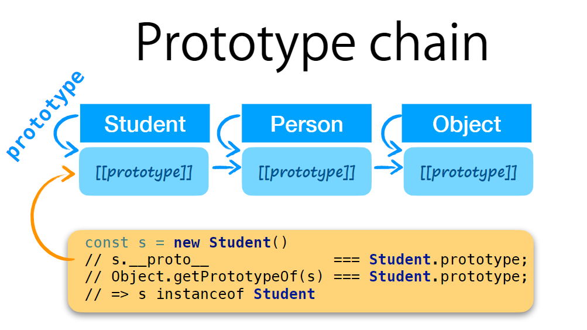

# Woche 7

<span style="background-color: #e0e0e0; border-radius: 10px; padding: 5px 10px;">29.10.2024</span>

### Inhalt

Slides

- [slides](WebProgramming_7_Classes.pdf)

Bearbeitet Dateien

TODO

- [AllTests.html](./AllTests.html)
- [object.js](./object/object.js)
- [objectTests.js](./object/objectTest.js)
- [inheritance.js](./inheritance/inheritance.js)
- [inheritanceTest.js](./inheritance/inheritanceTest.js)
- [util.js](./util/util.js)
- [utilTest.js](./util/utilTest.js)

##### Javascript Goodies

Array erzeugen mit Array Literal oder Array Constructor
`[]` oder `Array()`

```javascript
Array.from("abc");
//Output: ["a", "b", "c"]

// Array mit beliebiger Länge erzeugen
Array.from({ length: 10 });
// Output: [undefined, undefined, ...] (10)

// Index von map, [0..9]
Array.from({ length: 10 }).map((it, idx) => idx);
// Output: [0,1,2,3,4,5,6,7,8,9]

// 2. Argument ist map Funktion
Array.from({ length: 10 }, (it, idx) => idx);
// Output: [0,1,2,3,4,5,6,7,8,9]
```

##### Klassen

**Sind nicht wie Klassen in Java, teilen nicht gleiche Eigenschaften**

Keywords: `class`, `extends`

##### `class`:

Syntactic Sugar für Variante 3

```javascript
class Person {
  constructor(first, last) {
    this.firstname = first;
    this.lastname = last;
  }
  getName() {
    return this.firstname + this.lastname;
  }
}
// new Person("Good", "Boy") instance of Person
```

##### `extends`:

Syntactic Sugar für Prototype chain

```javascript
class Student extends Person {
  constructor(first, last, grade) {
    // nicht vergessen!
    super(first, last);
    this.grade = grade;
  }
}
const s = new Student("Top", "Student", 5.5);
```

##### Funktionen sind Objekte

- Sie haben das `prototype` Attribut
- Es zeigt auf ein Objekt das
  - einen Namen hat (~"Type")
  - einen Konstruktor hat (Type Function)
  - selber noch ein Attribut `prototype` hat

##### Objekte sind **keine** Funktionen

- Nicht im Sinne von Javascript Funktionen.
- Aber im Sinne der Informatik sind sie Funktionen (im allgemeinen Sinne) von ihren Schlüsseln zu ihren Werten

##### Prototypen-Kette



- Da ein Prototyp ein Objekt ist,
  kann er modifiziert und erweitert werden.
- Man kann den Prototyp zur Laufzeit ersetzen,
  wodurch sich im Wesentlichen der "Typ" ändert.
- `Object.setPrototypeOf(obj, proto);`

##### Dynamic Dispatch

- Eigenschaften (und somit auch Funktionen) werden  
  zuerst im Objekt selbst gesucht und  
  dann in seinem Prototypen.
- Und da Prototypen selbst Objekte sind,
  wird auch deren Prototyp verwendet (was eine Kette bis `Object.prototype` bildet).
- Das sieht aus wie eine klassiche Vererbung.

##### Dispatch

**Java**: Static, based on the static type<br>
**Groovy**: Dynamic, based on the runtime type<br>
**JavaScript**: Dynamic by name,
Pattern: Chain of Responsibility

### Wissenwertes / Gelerntes

Array mit beliebiger Länge erstellen:

```javascript
const n = 10; // Länge des Arrays
const array = Array.from({ length: n });
const arrayWithValues = Array.from({ length: n }, (it, idx) => idx * 2);
// Beispiel: Werte sind doppelte des Index
// Output: [0, 2, 4, 6, 8, 10, 12, 14, 16, 18]
```

Babel Editor:
https://babeljs.io/repl
